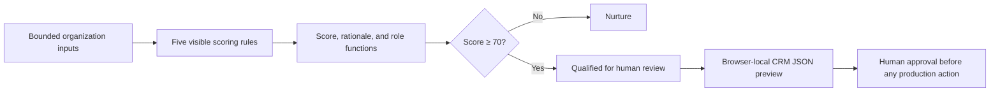

# CareSignal — Healthcare Lead-Scoring System

CareSignal turns bounded healthcare-organization signals into an explainable 0–100 review priority. Five visible, deterministic rules score organizational fit, operating scale, operational need, technical readiness, and buying intent; a score of 70 or higher enters a human-review queue. The demo uses invented organizations only and never collects patient data, protected health information (PHI), or personal prospect data.

**Live demo:** [prasiddhakarki.online/work/healthcare-lead-scoring](https://prasiddhakarki.online/work/healthcare-lead-scoring)

## What it demonstrates

- An editable scoring lab with six labeled synthetic fixtures.
- A complete point-by-point explanation for every score.
- Deterministic qualification at a documented 70-point threshold.
- Suggested decision-maker *functions* without identifying people.
- A qualified-account dashboard built for review, not automated pursuit.
- A HubSpot-style company payload preview and local JSON download with no CRM call.
- Accessible, responsive UI with semantic HTML, keyboard focus states, and reduced-motion support.

## Architecture



The interactive path is browser-local: editing, scoring, qualification, payload creation, and download all happen without sending a lead to an external system.

## Scoring model

The five factors total 100 points. The same input always produces the same output; there is no model inference or hidden coefficient.

| Factor | Exact rubric | Maximum |
| --- | --- | ---: |
| Organization fit | Health system 25; clinic network 22; payer 20; digital health 18; independent practice 12 | 25 |
| Operating scale | Employees: 1–24 = 2, 25–99 = 5, 100–249 = 8, 250–999 = 10, 1,000+ = 12. Locations: 1–2 = 1, 3–9 = 4, 10–24 = 6, 25+ = 8 | 20 |
| Operational need | Patient access 25; revenue cycle 22; clinical operations 20; analytics 18; exploring 5 | 25 |
| Technical readiness | API-ready 15; modern EHR 12; mixed systems 8; mostly manual 3 | 15 |
| Buying intent | 0–3 months 15; 3–6 months 12; 6–12 months 7; exploring 3 | 15 |

`score >= 70` means **qualified for human review**. It does not mean permission to contact, proof of buying intent, or an automated sales action.

## Synthetic fixture outcomes

| Fixture | Score | Result |
| --- | ---: | --- |
| Northstar Community Health | 100 | Qualified for human review |
| Meridian Specialty Network | 84 | Qualified for human review |
| Harbor Rural Alliance | 69 | Nurture |
| BrightPath Digital Health | 72 | Qualified for human review |
| Willow Independent Clinic | 46 | Nurture |
| Atlas Regional Plan | 54 | Nurture |

All 6 fixtures match their predeclared qualified-or-nurture expectation: **100% fixture agreement, with 3 qualified and 3 nurture outcomes**. This is a deterministic consistency check on a tiny invented dataset—not predictive accuracy, conversion lift, or a fairness audit.

## Safeguards and no-PHI boundary

- Inputs are limited to organization name, organization type, employee and location counts, operational priority, technical readiness, and buying timeline.
- There are no patient, diagnosis, treatment, claim, medical-record, health-outcome, email, or phone fields.
- Recommendations name role functions such as “VP of Patient Access,” never people, profiles, contact details, or inferred identities.
- Qualification only prioritizes human investigation; it does not trigger outreach.
- The CRM-shaped object is a preview. The demo has no HubSpot credential, makes no CRM request, and creates its JSON download with the browser Blob API.
- The bundled records are explicitly synthetic. Their outcomes must not be represented as evidence about real healthcare organizations.

CareSignal is a healthcare-adjacent sales-operations demonstration, not a clinical system. Any production use would require security, privacy, legal, and compliance review while preserving the organization-only data boundary.

## Tech stack

| Layer | Role |
| --- | --- |
| Next.js 16 + React 19 | Route metadata, server-rendered product page, and interactive client UI |
| TypeScript | Typed organization inputs, score factors, results, and handoff shape |
| CSS Modules | Isolated responsive styling, visible focus, and reduced-motion behavior |
| Browser Blob API | Local JSON preview download without a server or CRM request |
| Node test runner | Rendered-route and source-boundary assertions |
| Vinext / Cloudflare-compatible build | Produces the worker entry exercised by the route test |

## Run locally

This repository package is a feature slice from a larger application. Place the files at the paths in [`MANIFEST.md`](./MANIFEST.md) inside a compatible Next.js/Vinext host before running it. The source host uses Node.js 22.13 or newer and pnpm.

```bash
pnpm install
pnpm dev
```

Then open [http://localhost:3000/work/healthcare-lead-scoring](http://localhost:3000/work/healthcare-lead-scoring). If the host selects a different port, use the URL printed by the development server.

## Test

The route test loads the built worker, renders `/work/healthcare-lead-scoring`, and checks the visible product contract, scoring weights, fixture count, human gate, local-only handoff, and accessibility/responsive safeguards.

```bash
pnpm run build
node --test --test-concurrency=1 tests/healthcare-lead-scoring.test.mjs
```

In the source host, `pnpm test` builds and runs the entire test suite.

## Production integration seams

The demo deliberately stops before real data or external actions. A production implementation should add these boundaries explicitly:

| Seam | Production responsibility |
| --- | --- |
| Scoring engine | Extract the pure rules from the UI, version the rubric, validate inputs, and retain the score rationale and rule version |
| Organization data | Accept only approved company-level sources; enforce schema, provenance, freshness, and the no-PHI/no-personal-data contract |
| Review workflow | Persist qualified and nurture states, require an authenticated reviewer, and record approve/reject decisions |
| CRM adapter | Map the existing company-property preview to a server-side adapter with secret management, idempotency, allowlists, retries, and dry-run support |
| Audit and security | Add authorization, immutable audit events, retention controls, rate limits, monitoring, and incident procedures |
| Evaluation | Calibrate thresholds on consented business outcomes and perform ongoing error, drift, and disparate-impact review before operational use |

The invariant across every seam is simple: a score informs a person; it never silently becomes outreach.
# healthcare-lead-scoring-system
Explainable 0–100 healthcare organization lead scoring with synthetic fixtures, human review, and a browser-local CRM handoff.
